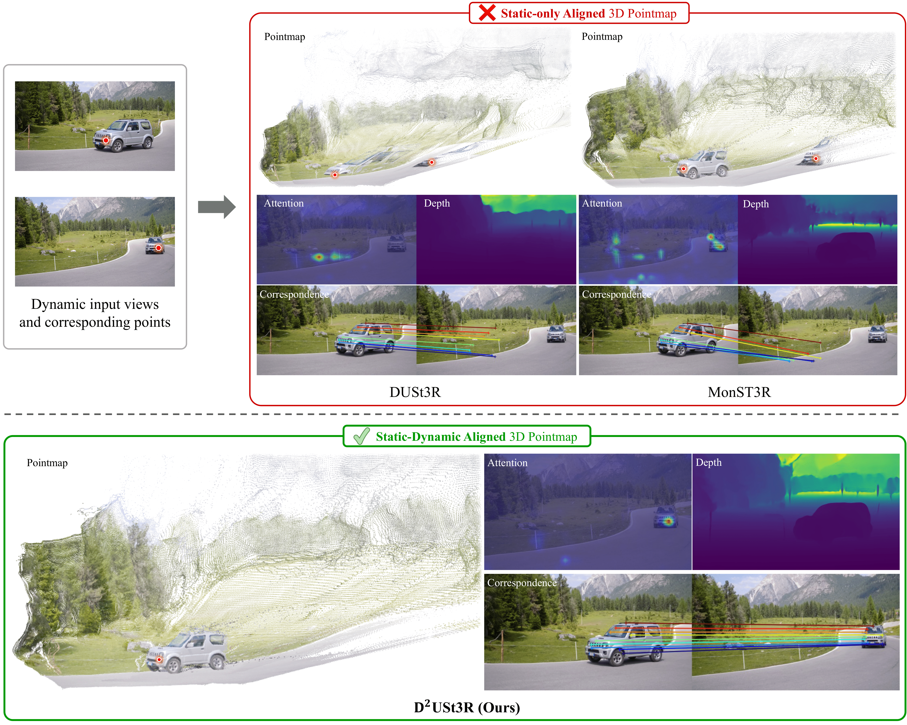

<div align="center">
  <h1>
    <span class="colorful_text">D<sup>2</sup>USt3R</span>: Enhancing 3D Reconstruction with 4D Pointmaps for Dynamic Scenes
  </h1>
  
  [**Jisang Han**](https://onground-korea.github.io)<sup>1\*</sup> · [**Honggyu An**](https://hg010303.github.io/)<sup>1\*</sup> · [**Jaewoo Jung**](https://crepejung00.github.io/)<sup>1\*</sup> · **Takuya Narihira**<sup>2</sup> · [**Junyoung Seo**](https://j0seo.github.io/)<sup>1</sup> · **Kazumi Fukuda**<sup>2</sup> · [**Chaehyun Kim**](https://kchyun.github.io/)<sup>1</sup> · [**Sunghwan Hong**](https://sunghwanhong.github.io/)<sup>3</sup> · [**Yuki Mitsufuji**](https://www.yukimitsufuji.com/)<sup>2,4&dagger;</sup> · [**Seungryong Kim**](https://cvlab.kaist.ac.kr/members/faculty)<sup>1&dagger;</sup>

<sup>1</sup>KAIST AI&emsp;&emsp;&emsp;&emsp;<sup>2</sup>Sony AI&emsp;&emsp;&emsp;&emsp;<sup>3</sup>Korea University&emsp;&emsp;&emsp;&emsp;<sup>4</sup>Sony Group Corporation

*: Co-First Author <br>
&dagger;: Co-Corresponding Author

**NeurIPS 2025**
<h3 align="center"><a href="">Paper </a> | <a href="https://cvlab-kaist.github.io/DDUSt3R">Project Page </a> </h3>

<p align="center">
  <a href="">
    
  </a>
</p>
</div>

> We propose $D^2USt3R$, a feed-forward framework that overcomes the rigidity assumptions of prior pointmap regression methods by directly regressing Static-Dynamic Aligned Pointmaps (SDAP), which simultaneously align spatial structures and *temporal motions* to achieve state-of-the-art 3D reconstruction in dynamic scenes and understand motions.

**What to expect:**

- [x] Demo inference code
- [ ] Evaluation code
- [ ] Training code

## Installation

Our code is developed based on pytorch 2.5.1, CUDA 12.1 and python 3.11. 

1. We recommend using [conda](https://docs.anaconda.com/miniconda/) for installation:

```bash
conda create -n ddust3r python=3.11 cmake=3.14.0
conda activate ddust3r
pip install torch==2.5.1 torchvision==0.20.1 torchaudio==2.5.1 --index-url https://download.pytorch.org/whl/cu121 # use the correct version of cuda for your system
pip install -r requirements.txt
```

2. Optional, compile the cuda kernels for RoPE (as in CroCo v2).
```bash
# DUST3R relies on RoPE positional embeddings for which you can compile some cuda kernels for faster runtime.
cd croco/models/curope/
python setup.py build_ext --inplace
cd ../../../
```

### Download Checkpoints
We currently provide fine-tuned model weights for DDUSt3R, which can be downloaded on [Google Drive]().

### Inference

To run the inference code, you can use the following command:
```bash
python demo.py # launch GUI, input can be a folder consisting two input images
```

## Citation

If you find our work useful, please cite:

```bibtex
@article{han2025d,
  title={D\^{} 2USt3R: Enhancing 3D Reconstruction with 4D Pointmaps for Dynamic Scenes},
  author={Han, Jisang and An, Honggyu and Jung, Jaewoo and Narihira, Takuya and Seo, Junyoung and Fukuda, Kazumi and Kim, Chaehyun and Hong, Sunghwan and Mitsufuji, Yuki and Kim, Seungryong},
  journal={arXiv preprint arXiv:2504.06264},
  year={2025}
}
```

## Acknowledgements
Our code is based on [MonST3R](https://github.com/junyi42/monst3r) and [DUSt3R](https://github.com/naver/dust3r). We thank the authors for their excellent work!
